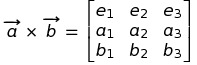

# Cross Product (Euclid & Minkowski)

## Cross Product in the Euclidean Space:

a x b	= (a1e1 +a2e2+a3e3 ) x (b1e1 + b2e2 + b3e3 ) = 

= ( a1b2 -  a2b1 ) (e3) +  ( a3b1  - a1b3 ) (e2 )  +  ( a2b3 -  a3b2 ) ( e1  ) 

## Cross Product in the Minkowskian Spacetime:

a x b	=  ( a1e1 +a2e2 +a0e0 )  x  (b1e1 + b2e2 +  b0e0  )  =    

=	( a1b2 -  a2b1 ) e0   + ( a0b1 -  a1b0 )(-e2) +  ( a2b0  - a0b2 ) (- e1)  

A continuación un documento feito con MS Office 2010.

[Algebraic calculations (PDF)](../documents/Cross.pdf)

De seguido o mesmo documento feito con LibreOffice 5.

[Algebraic calculations (PDF)](../documents/documento-cross-libre-office.pdf)

E o orixinal en formato `.odt`.

[Algebraic calculations (ODT)](../documents/documento-cross-libre-office.odt)

__Pensa nos pobres gatiños__
