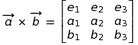
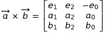

# Propiedades da xeometría seudoeuclídea
Como consecuencia do cambio na métrica, aparecen unha seride de propiedades xeométricas radicalmente diferentes entre os espazos de Euclides e Minkowski

## Distancia entre 2 puntos (ou módulo dun vector)
* para Euclides: raíz cadrada da SUMA dos cadrados de cada coordenada. 
  Equivale á superficie dun triángulo rectángulo e isósceles coa hipotenusa sobre o segmento que une os puntos.
  
  d² = x² + y²
  
* para Minkowski: raiz cadrada da RESTA dos cadrados de cada coordenada. 
  Equivale á superficie dun triángulo rectángulo coa hipotenusa sobre o segmento que une os puntos e cos catetos paralelos ás direccións asintóticas (bisectrices dos eixes de coordenadas).
  
  d² = x² - t²

## Lugar común de puntos equidistantes dun dado (centro)
  * para Euclides:
    - Circunferencia (2D)
    - Esfera (3D)

  * para Minkowski:
    - Hipérbola equilátera recta (1,1)D
    - Hiperboloide de revolución (2,1)D
  
## Ortogonalidade
  * para Euclides: Xiro de 90º
  * para Minkowski: reflexión sobre as direccións asintóticas (diagonais dos eixes)
  
## Ángulo
  * para Euclides: superficie dos arcos dun círculo (unitario) delimitados por dúas rectas coincidentes no centro.
  * para Minkowski: superficie dos arcos dunha hipérbola (unitaria) delimitados por dúas rectas coincidentes no centro.
  
## Produto Vectorial  ou [Cross Product](CrossProduct.md)
Esta é unha propiedade do espazo 3D que se pode usar no subespazo 2D para construír unha dirección perpendicular a outra dada.
* para Euclides:  o Cross obtense como un determinante cunha fila na que están os vectores da base (ortonormal) e dúas filas coas compoñentes dos dous vectores a multiplicar.

* para Minkowski, o Cross obtense como un determinante cunha fila na que están os vectores da base (ortonormal) e dúas filas coas compoñentes dos dous vectores a multiplicar. A diferenza co caso euclidiano consiste en que os dous vectores espaciasi da base están cambeados de signo.

## Rotación
  * para Euclides: xiro (dun certo ángulo)  ao redor dun punto dado  
          o único punto que permanece invariante nun xiro euclídeo é o centro do mesmo
  * para Minkowski: boost (xiro hiperbólico cun certo ángulo hiperbólico) centrado nun punto dado.   
          as dúas liñas asintóticas (diagonais aos eixes cartesiáns pasando polo centro da rotación) permanecen invariantes nun boost.
